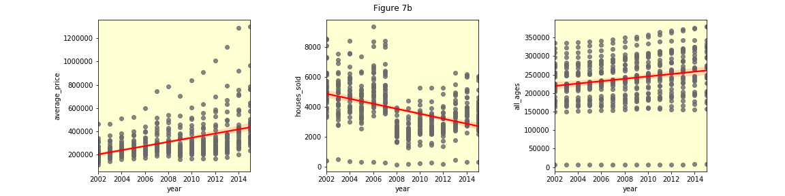

# London Housing and Population Analysis (2002 - 2015)

My goal in this project is to explore the relationship between the London housing market (number of houses sold and average house sell price) and changes in the age make-up of the city's population, between 2002 and 2015. 

In this analysis I experiment with Pandas, Matplotlib, Seaborn, and Jupyter Notebooks.  There are [11 code steps](https://github.com/csmyth215/london_housing_eda/tree/master/jupyter_notebooks) to this EDA, including preparation, cleaning and merging of the data sets.  The [_Analysis Summary.ipynb_](https://github.com/csmyth215/london_housing_eda/blob/master/London%20Housing%20EDA%20-%20Analysis%20Summary.ipynb) summarises what I tried and found out.

The data sets used are:

>i) [Pricing and sales figures](https://www.kaggle.com/justinas/housing-in-london) from the London Datastore, combined and made available by Justinas Cirtautas on Kaggle.  
>ii) [London Borough population figures](https://data.london.gov.uk/dataset/office-national-statistics-ons-population-estimates-borough) from the London Datastore/Office for National Statistics.

I first demonstrate trends in house sales and prices, on the regional and on a London borough level.  I then show how the age composition of borough populations has changed over time.  Finally, I combine housing and population data sets to determine whether there is a direct correlation between increasing population in a particular age group and increasing house sales and prices.  This last stage focuses on 10 selected boroughs: those with the biggest and the smallest relative change in house prices over the 14-year period.